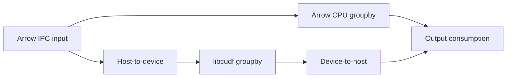

# GPU Data Operator Lab

[](https://github.com/JDinSeattle/gpu-data-operator-lab/actions/workflows/ci.yml)

An Arrow-to-libcudf groupby study that asks two practical questions: **are the records exactly reconciled, and does the GPU still help after data movement?** Nullable integer cents and keys keep reconciliation exact while exercising database-library semantics.

**12 CPU/Arrow/GPU cases** include empty/all-null columns, null keys, duplicate keys, integer boundaries, a million rows and heavily skewed groups. Independent counts and sums must agree. [Measured crossover, transfer costs, memory and raw evidence](docs/RESULTS.md).

## Reproduce

Requires Linux, a RAPIDS-compatible NVIDIA GPU/driver, CUDA toolkit/Compute Sanitizer/Nsight Systems, and uv:

```bash
bash scripts/reproduce.sh
```

The locked environment pins pylibcudf 26.8.1, Arrow 25.0.1 and matching CUDA Python bindings. CPU-only: install NumPy, PyArrow and pytest, then `python scripts/run.py --cpu-only`. Report: `python scripts/summarize.py results/<run-directory>`.

## What the comparison measures

- A Python arbitrary-width integer oracle and a separate multithreaded Arrow groupby baseline.
- Direct pylibcudf Arrow C-data interop and explicit null-key/count policies.
- Exact normalized group results, row conservation and valid-value conservation; duplicate output groups cannot be hidden by sorting.
- Resident operator, H2D, D2H and complete IPC-load/aggregate/output-consumption timings.
- Separate Nsight CUDA kernel/transfer traces, RMM peak-allocation accounting and controlled capacity rejection.
- Mutations that drop null keys, invent zero sums, change count semantics or corrupt groups.



This is a focused data-infrastructure bridge to GPU library engineering. It does not replace a database or claim universal SQL/NaN/decimal semantics. The [contract](docs/contract.md) defines nulls, overflow, ordering and memory limits; the [interview guide](docs/INTERVIEW.md) ties each claim to evidence. CPU CI does not certify the GPU path.
